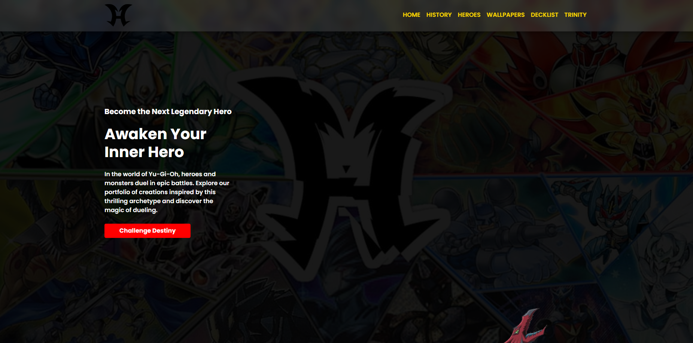
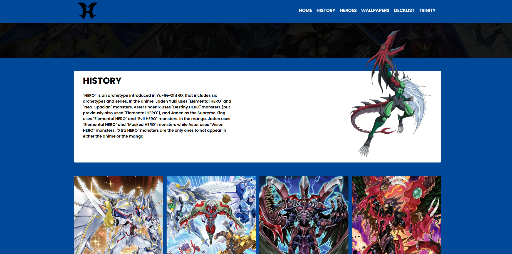
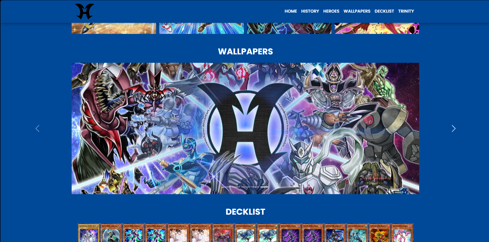
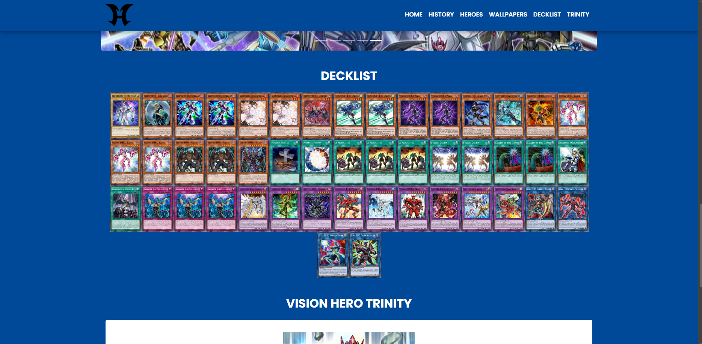
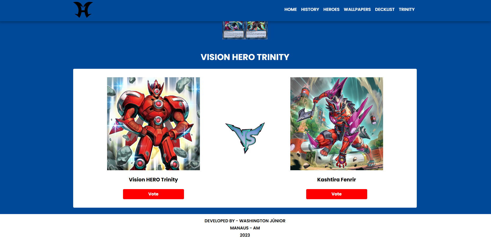

# 🦸 Heroes - Yu-Gi-Oh Themed Web Project

Projeto desenvolvido com foco em prática de JavaScript, consumo de API e manipulação de DOM, inspirado no arquétipo HERO de Yu-Gi-Oh.

🔗 Acesse o projeto: https://heroes-washington-jr.netlify.app

---

## 📌 Sobre o projeto

Este projeto consiste em uma landing page temática baseada no arquétipo HERO do universo de Yu-Gi-Oh, com integração à API pública **YGOPRODeck** para exibição dinâmica de cartas.

Além da parte visual, o projeto também explora interatividade com JavaScript, incluindo consumo de API, manipulação de dados e um mini game.

---

## 🚀 Funcionalidades

- 📖 Seção de história sobre o arquétipo HERO
- 🖼️ Slider de wallpapers temáticos
- 🃏 Consumo de API para exibição de deck (YGOPRODeck)
- ⚔️ Mini game de batalha entre cartas
- ⏳ Tela de loading durante requisições
- 🎨 Interface responsiva e estilizada

---

## 🧠 Tecnologias utilizadas

- HTML5  
- CSS3  
- JavaScript  
- API REST (YGOPRODeck)

---

## 🔌 Integração com API

O projeto consome dados da API pública:

👉 https://ygoprodeck.com/api-guide/

Utilizada para:
- Buscar cartas do arquétipo HERO  
- Montar dinamicamente o deck exibido  

---

## 🎮 Mini Game

O projeto conta com um mini game simples onde:

- O usuário enfrenta o **Vision HERO Trinity**
- O sistema seleciona cartas adversárias da API
- Simula uma "batalha" entre os monstros

💡 Curiosidade:  
O Trinity sempre vence como referência ao meme do *"Trinity Crash"* 😄

---

## 📷 Preview

### 🏠 Página inicial

### 📖 História

### 🖼️ Wallpapers

### 🃏 Deck (API)

### 🎮 Mini Game

---

## ⚙️ Como executar o projeto

1. Clone o repositório:
bash
git clone https://github.com/seu-usuario/seu-repo.git

2. Abra o arquivo index.html no navegador

---

## 📚 Aprendizados

Neste projeto foram praticados:
- Consumo de API com JavaScript
- Manipulação de DOM
- Organização de código front-end
- Criação de interações dinâmicas
- Estruturação de layout responsivo

---

## 👨‍💻 Autor

Desenvolvido por Washington Júnior
📍 Manaus - AM

🔗 LinkedIn: https://www.linkedin.com/in/washington-junior-bb1540245/
